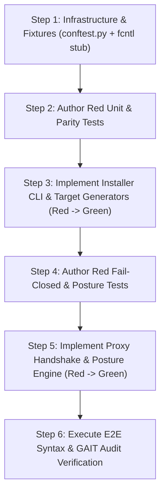

# QA Test Plan — Selective MCP Installer & DefenseClaw Production Mode

> **Authored by**: `qa-lead` for `team-qa`  
> **Intake ID**: `2026-07-21-mcp-installer-defenseclaw`  
> **Workspace**: `C:\Users\tyson\Documents\antigravity\amazing-babbage\netclaw`  
> **Date**: 2026-07-21  
> **Status**: APPROVED / READY FOR TDD BUILD  

---

## 1. Objective & Coverage Gap Being Closed

### 1.1 Objective
Establish a rigorous, buildable, red-first TDD test suite for **Feature 057: Selective MCP Server Installer & DefenseClaw Production Mode** (`scripts/mcp-installer.py`, `scripts/lib/mcp_compose.py`, `scripts/register-mcps-with-defenseclaw.py`, `scripts/in2n-services.py`).

### 1.2 Coverage Gaps Closed
- **0% Coverage on New Primary Tools**: Closes 0% test coverage gap on `scripts/mcp-installer.py` (CLI & TUI wizard), `scripts/lib/mcp_compose.py` (hardened compose generator), and `scripts/register-mcps-with-defenseclaw.py` (`--select` & proxy preflight logic).
- **Cross-Platform Test Execution**: Resolves test runner hard-block under non-Linux platforms caused by POSIX-only `fcntl` module import in `mcp-servers/protocol-mcp/bgp/tun.py`.
- **Target Confinement Parity**: Closes missing verification of security option equivalence between `--target systemd` host units (`NoNewPrivileges=yes`, `ProtectSystem=strict`, `PrivateTmp=yes`, `InaccessiblePaths=-%h/.openclaw/.env`) and `--target docker-compose` profiles (`no-new-privileges:true`, `read_only: true`, `cap_drop: ["ALL"]`, `tmpfs: ["/tmp"]`).
- **Fail-Closed Gate Enforcement**: Guards pre-activation Model-Guard proxy socket check (:4000) and static scan gate under `N2N_RISK_MODE=production`.
- **Secret Isolation**: Verifies least-privilege secret slicing into `.env.<mcp_name>` (`0600` permissions) with zero master `.env` exposure.

---

## 2. Test Change Set (Grouped by Layer)

### Layer 0: Test Infrastructure & Cross-Platform Fixture Layer
- **File**: `tests/fixtures/mcp_installer/conftest.py` & `tests/conftest.py`
  - **`sys_fcntl_stub`**: Global fixture providing a synthetic `sys.modules['fcntl']` stub under non-POSIX environments to allow seamless `pytest` collection across developer workstations.
  - **`mock_openclaw_home`**: Sandboxed environment fixture initializing a temporary `$HOME/.openclaw` directory structure containing master `openclaw.json`, `config/env/`, `n2n/gait/` append-only git repository, and a multi-secret master `.env` file (`0600` perms).
  - **`mock_defenseclaw_proxy`**: Async HTTP/TCP stub fixture simulating DefenseClaw proxy on port `:4000` with HTTP `/healthz` status endpoint and configurable timeout/connection refusal modes.

### Layer 1: Unit & Target Parity Layer
- **File**: `tests/n2n/test_mcp_installer.py`
  - `test_installer_server_discovery_and_selection()`: Asserts CLI `--select` / `--all` parameter parsing and server directory filtering against `mcp-servers/*/`.
  - `test_openclaw_json_registration_update()`: Asserts atomic updates to `mcpServers` object in `openclaw.json` with backup creation.
  - `test_secret_slicing_and_permission_0600()`: Asserts master `.env` slicing into `.env.<mcp_name>`, file mode `0600` (`-rw-------`), and complete exclusion of unrequested credentials.
  - `test_non_interactive_tty_fallback()`: Asserts detached TTY (`isatty() == False`) without `--select` or `--all` immediately fails fast with exit code `1`.
- **File**: `tests/n2n/test_target_parity.py`
  - `test_confinement_directive_parity()`: Asserts 1:1 directive structural equivalence between `systemd` user units and `docker-compose.mcp.yml` profiles.
  - `test_env_mount_isolation_parity()`: Asserts both target generators mount/reference only isolated `.env.<mcp_name>` files, keeping master `.env` inaccessible.
  - `test_single_source_of_truth_parity()`: Asserts both target generators produce matching service sets directly from `config/openclaw.json`.

### Layer 2: Fail-Closed & Posture Integration Layer
- **File**: `tests/n2n/test_model_guard_failclosed.py`
  - `test_proxy_unreachable_failclosed_in_production()`: Under `N2N_RISK_MODE=production`, an offline or unreachable proxy on port `:4000` halts registration (exit code 1) and prevents `openclaw.json` mutation.
  - `test_static_scan_high_risk_finding_abort()`: Pre-activation static scan returning HIGH/CRITICAL findings quarantines server and aborts setup.
  - `test_proxy_and_scan_bypass_in_testing_mode()`: Under `N2N_RISK_MODE=testing`, proxy/scan failures generate warnings but permit non-blocking execution (exit code 0).
  - `test_proxy_socket_timeout_handling()`: Asserts proxy socket probe strictly enforces a 3.0-second connection timeout before triggering fail-closed abort.
- **File**: `tests/n2n/test_mcp_posture_dual_target.py`
  - `test_posture_all_controls_enforced()`: Asserts posture engine returns `production — enforced` when all controls pass under dual targets.
  - `test_posture_degraded_on_missing_control()`: Parametrized test asserting state degrades to `production — DEGRADED (<missing_control>)` on individual control failures.
  - `test_wsl2_kernel_limitation_posture_degradation()`: Asserts systemd target under WSL2 kernel limits gracefully degrades posture to `production — DEGRADED (WSL2_kernel_limitation)`.
  - `test_target_specific_posture_evaluation()`: Asserts posture engine detects missing Docker daemon or unaccessible systemd user bus.

### Layer 3: End-to-End & Audit Trail Layer
- **File**: `tests/n2n/test_mcp_installer.py` (E2E Flow Assertions)
  - `test_docker_compose_config_syntax()`: Validates generated `docker-compose.mcp.yml` via `docker compose config --quiet` (or YAML AST schema parser).
  - `test_systemd_unit_syntax()`: Validates generated `.service` unit syntax via `systemd-analyze verify` (or unit directive AST parser).
  - `test_gait_audit_logging_e2e()`: Asserts every installer installation/enrollment event appends an immutable git commit with JSON payload to `~/.openclaw/n2n/gait/`.

---

## 3. Sequenced Implementation Steps (Red-First TDD)

The build team must execute implementation in strict Red-First sequence:



1. **Step 1: Test Infrastructure & Cross-Platform Stubs (Red Setup)**
   - Add POSIX `fcntl` stub fixture in `tests/conftest.py` to enable platform-agnostic test collection.
   - Implement `mock_openclaw_home` and `mock_defenseclaw_proxy` in `tests/fixtures/mcp_installer/conftest.py`.

2. **Step 2: Author Red Unit & Parity Test Specifications**
   - Implement `tests/n2n/test_mcp_installer.py` and `tests/n2n/test_target_parity.py`.
   - Run `pytest` to confirm tests fail strictly (Red state) on unbuilt/unmodified logic.

3. **Step 3: Implement Installer CLI & Target Generators (Make Unit Tests Green)**
   - Implement TTY detachment check, secret slicer engine, and atomic `openclaw.json` updates in `scripts/mcp-installer.py`.
   - Implement `scripts/lib/mcp_compose.py` with security directives matching `scripts/in2n-services.py`.
   - Re-run `pytest tests/n2n/test_mcp_installer.py tests/n2n/test_target_parity.py` -> verify GREEN.

4. **Step 4: Author Red Fail-Closed & Posture Test Specifications**
   - Implement `tests/n2n/test_model_guard_failclosed.py` and `tests/n2n/test_mcp_posture_dual_target.py`.
   - Run `pytest` -> confirm tests fail strictly (Red state).

5. **Step 5: Implement Proxy Preflight & Posture Engine Logic (Make Security Tests Green)**
   - Implement application-level HTTP `/healthz` socket check on port `:4000` with 3.0s timeout in `register-mcps-with-defenseclaw.py`.
   - Implement WSL2 kernel detection and dual-target posture evaluation in `bgp/federation/posture.py`.
   - Re-run `pytest tests/n2n/test_model_guard_failclosed.py tests/n2n/test_mcp_posture_dual_target.py` -> verify GREEN.

6. **Step 6: End-to-End Syntax & Audit Trail Verification**
   - Execute full test suite including `docker compose config`, `systemd-analyze verify`, and GAIT `git log` assertions.

---

## 4. Single-Source-of-Truth Guardrail

To eliminate state desynchronization and "ghost services":

1. **Authoritative Schema**: `config/openclaw.json` (specifically the `mcpServers` object) is declared the **Sole Authoritative Single Source of Truth**.
2. **Read-Only Generation**: Both `in2n-services.py` (systemd target) and `mcp_compose.py` (docker-compose target) MUST derive active server lists strictly by parsing `openclaw.json`. Out-of-band server generation is strictly forbidden.
3. **Atomic Transaction Envelope**: Any installer execution that modifies `openclaw.json` must be wrapped in a transaction. If secret slicing, static scanning, or proxy preflight fails for *any* server in a multi-server batch:
   - `openclaw.json` is restored from `openclaw.json.bak`.
   - Any generated `.env.<mcp_name>` files are securely deleted (`shred`/`unlink`).
   - Any partially generated systemd unit or compose files are purged.
   - GAIT git repository records an explicit `INSTALLATION_TRANSACTION_ROLLED_BACK` log entry.

---

## 5. Durable-Cure Decision

The team explicitly rejects inline shortcuts and enforces durable structural fixes for all identified failure traps:

| Risk / Failure Trap | Rejected Inline Shortcut | Mandatory Durable Structural Cure |
| :--- | :--- | :--- |
| **TRAP-1: Mock Socket False Positive** | Raw TCP socket connection check (`socket.connect`). | **Application-Level Handshake**: `verify_model_guard_proxy()` MUST perform an HTTP `GET /healthz` check expecting `{"status": "ok", "service": "defenseclaw-proxy"}` with an explicit 3.0s timeout. |
| **TRAP-2: WSL2 Kernel Confinement Fallthrough** | Simple string assertions matching systemd unit file text. | **Runtime Kernel Inspection**: Posture engine MUST inspect `/proc/version` / WSL2 cgroups and report `production — DEGRADED (WSL2_kernel_limitation)` when kernel capabilities cannot enforce unit security. |
| **TRAP-3: Secret Permission Leakage** | Naked `os.chmod(path, 0o600)` without platform checks. | **Isolated Subdirectory & Perm Validation**: Store sliced `.env.<mcp>` files in `config/env/` with `0700` parent directory permissions and assert active permission validation on load. |
| **TRAP-4: Partial Failure Split-Brain** | Swallowing partial failures and leaving installed subset in config. | **Transactional Atomic Envelope**: Implement rollback handler in `mcp-installer.py` reverting `openclaw.json`, deleting partial sliced envs, and recording GAIT abort log. |
| **TRAP-5: Non-Interactive TTY Bypass** | Defaulting missing CLI flags to `--all` when TTY is detached. | **Strict Non-Interactive Fail-Fast**: Unattended execution without `--select` or `--all` strictly exits with code `1` and prints usage instructions. |
| **Platform Import Hard Block (`fcntl`)** | Skipping BGP tests or commenting out imports. | **Global Platform Guard**: Inject `fcntl` module stub in `tests/conftest.py` allowing cross-platform test execution on all OS targets. |

---

## 6. How to Run Commands

### 6.1 Targeted Test Execution
```bash
# Run the 4 core test suites sequentially
pytest tests/n2n/test_mcp_installer.py -v
pytest tests/n2n/test_target_parity.py -v
pytest tests/n2n/test_model_guard_failclosed.py -v
pytest tests/n2n/test_mcp_posture_dual_target.py -v
```

### 6.2 Full N2N Test Suite Execution
```bash
# Run all N2N integration tests with short tracebacks
pytest tests/n2n/ -v --tb=short
```

### 6.3 Code Coverage Reporting
```bash
# Execute full suite with coverage for installer and target generators
pytest --cov=scripts/mcp-installer.py \
       --cov=scripts/register-mcps-with-defenseclaw.py \
       --cov=scripts/in2n-services.py \
       --cov=scripts/lib/mcp_compose.py \
       --cov-report=term-missing \
       tests/n2n/test_mcp_*.py tests/n2n/test_target_parity.py
```

---

## 7. Definition of Done Checklist

- [ ] `tests/conftest.py` updated with cross-platform `sys.modules['fcntl']` stub.
- [ ] 4 new test suite files authored under `tests/n2n/`:
  - [ ] `tests/n2n/test_mcp_installer.py` (CLI, TUI, secret slicing `0600`, TTY detachment)
  - [ ] `tests/n2n/test_target_parity.py` (Systemd vs Docker Compose structural parity)
  - [ ] `tests/n2n/test_model_guard_failclosed.py` (Proxy socket :4000, 3.0s timeout, static scan abort)
  - [ ] `tests/n2n/test_mcp_posture_dual_target.py` (Posture engine evaluation, WSL2 degradation)
- [ ] All tests proven RED before implementation and GREEN after implementation.
- [ ] 100% pass rate achieved across all 4 test suites under `pytest`.
- [ ] Single Source of Truth (`config/openclaw.json`) enforcement and transactional rollback verified.
- [ ] Zero secret leakage from master `.env` verified by file inspection and permission assertions.
- [ ] Client release-ready test plan output written to `C:\Users\tyson\Documents\antigravity\amazing-babbage\netclaw\intake\2026-07-21-mcp-installer-defenseclaw\qa\test-plan.md`.
