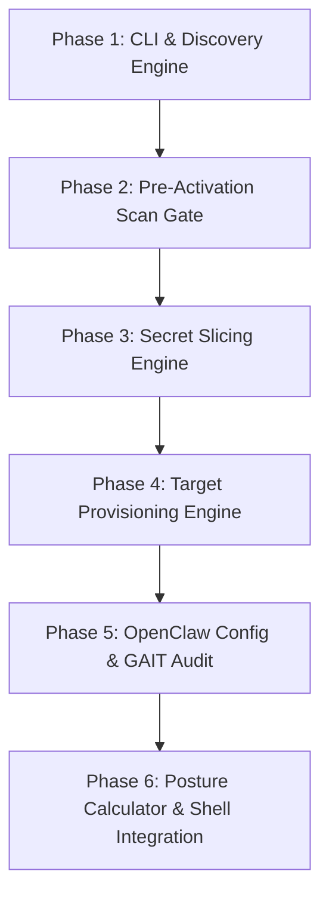

# Software Engineer Findings — MCP Installer with DefenseClaw Production Mode

- **Intake ID**: `2026-07-21-mcp-installer-defenseclaw`
- **Role**: `intake-engineer` (Software Engineer for team-intake)
- **Target Feature**: Feature 057 - N2N Production Posture & Selective MCP Server Installer
- **Workspace**: `C:\Users\tyson\Documents\antigravity\amazing-babbage\netclaw`
- **Date**: 2026-07-21

---

## 1. Exact Change Set

### Files to Create / Modify

1. **`scripts/mcp-installer.py`** *(New Script)*:
   - Primary CLI utility & interactive wizard for selective MCP server installation.
   - Parses flags (`--select`, `--all`, `--target`, `--mode`, `--list`, `--dry-run`).
   - Discovers MCP servers in `mcp-servers/`, loads schema dependencies, executes security pre-scans, slices `.env` secrets, generates target configs (`docker-compose.yml` or systemd units), and updates `openclaw.json`.
   - Records all mutations to GAIT append-only audit log in `~/.openclaw/n2n/gait/`.

2. **`scripts/register-mcps-with-defenseclaw.py`** *(Modify)*:
   - Extend `load_openclaw_config()` and `main()` to support selective list filtering (`--select mcp1,mcp2`).
   - Add pre-activation validation function `verify_model_guard_proxy()` checking `:4000` availability when `N2N_RISK_MODE=production`.
   - Implement fail-closed registration gate when scanning fails or proxy is unreachable under production mode.

3. **`scripts/in2n-services.py`** *(Modify)*:
   - Add helpers `_mcp_unit_text(mcp_name, command, env_file)` to support host-confined systemd user unit generation for standalone MCP servers.
   - Update `cmd_generate` to handle selective MCP service provisioning alongside mesh daemon and always-on member claws.

4. **`docker-compose.yml` / Template Generator** *(New Module in `scripts/lib/mcp_compose.py` or inline in `mcp-installer.py`)*:
   - Generates production-grade container orchestration stack for selective MCP servers.
   - Includes hardened container definitions (`security_opt: ["no-new-privileges:true"]`, `read_only: true`, `tmpfs: ["/tmp"]`, `cap_drop: ["ALL"]`, sliced env mounts, network link to `:4000`).

5. **`scripts/setup.sh` & `scripts/install.sh`** *(Modify)*:
   - Add step invoking `scripts/mcp-installer.py` during interactive installation/setup flows.

6. **`config/openclaw.json` & `~/.openclaw/config/openclaw.json`** *(Modify / Managed by Installer)*:
   - Structure `mcpServers` object dynamically based on selective installation choices.

---

### Detailed Code Changes & Functions

#### A. In `scripts/mcp-installer.py`:
- `discover_mcp_servers() -> dict[str, dict]`: Scans `mcp-servers/` for all available servers, extracting entry points, required env vars, and current status.
- `slice_secrets_for_mcp(mcp_name: str, env_vars: dict) -> Path`: Extracts specified secret keys from host `.env` or master environment, writes dedicated `.env.<mcp_name>` with strict `0600` permissions.
- `run_preactivation_scan(mcp_name: str, mcp_dir: Path) -> tuple[bool, list]`: Invokes `scripts/scan-all-mcp-source.py` logic against target MCP server; enforces fail-closed abort if HIGH/CRITICAL issues exist under `N2N_RISK_MODE=production`.
- `generate_docker_compose(selected_mcps: list[str], output_path: Path) -> None`: Constructs hardened Docker Compose specification with environment slice mounts and DefenseClaw proxy network integration.
- `generate_systemd_units(selected_mcps: list[str]) -> list[str]`: Interfaces with `scripts/in2n-services.py` to create systemd user units with kernel confinement (`NoNewPrivileges`, `ProtectSystem=strict`, private `/tmp`).
- `commit_gait_audit_event(action: str, mcp_name: str, details: dict) -> None`: Appends structured JSON log event and git commit to `~/.openclaw/n2n/gait/`.
- `calculate_runtime_posture(target: str, selected_mcps: list[str]) -> str`: Returns `production - enforced`, `production - DEGRADED (<reasons>)`, or `testing`.

#### B. In `scripts/register-mcps-with-defenseclaw.py`:
- `verify_model_guard_proxy(port: int = 4000) -> bool`: Checks TCP connectivity to DefenseClaw Go Proxy.
- `register_single_mcp(name: str, config: dict, fail_closed: bool) -> bool`: Executes `defenseclaw mcp set` with strict posture checks.

#### C. In `scripts/in2n-services.py`:
- `_mcp_unit_text(mcp_name: str, exec_start: str, env_file: str) -> str`: Generates host-level systemd unit for MCP server process with portable kernel confinement.

---

## 2. Feasibility & Gotchas

### Technical Feasibility: High
- The project already possesses robust Python base utilities (`scripts/scan-all-mcp-source.py`, `scripts/in2n-services.py`, `scripts/register-mcps-with-defenseclaw.py`).
- Adding `scripts/mcp-installer.py` relies standard Python 3.10+ standard libraries (`argparse`, `json`, `subprocess`, `pathlib`, `shutil`, `urllib`).

### Key Gotchas & Technical Risks

1. **Secret Isolation Mechanics**:
   - *Gotcha*: `openclaw.json` currently references environment variables via `${VAR_NAME}` placeholders.
   - *Risk*: Passing the full host environment or mounting the master `.env` breaks secret isolation.
   - *Solution*: The installer must parse variable dependencies per MCP, extract real values into an isolated `.env.<mcp_name>` file with `0600` permissions, and explicitly pass only that slice to the container or systemd unit.

2. **Dual-Target Posture Parity (DEC-001)**:
   - *Gotcha*: Host systemd user units use kernel directives (`NoNewPrivileges=yes`, `ProtectSystem=strict`, `InaccessiblePaths`), while Docker Compose uses container security opts (`security_opt: [no-new-privileges:true]`, `read_only: true`, `cap_drop: [ALL]`).
   - *Risk*: Posture engine misclassifying containerized deployment as non-compliant or vice versa.
   - *Solution*: Posture calculation must explicitly audit the target capability matrix (checking container security profile under Docker Compose vs systemd directives under systemd) before issuing `production - enforced`.

3. **Fail-Closed Guard Availability in Production**:
   - *Gotcha*: Under `N2N_RISK_MODE=production`, if `:4000` (DefenseClaw Model-Guard proxy) is unreachable, MCP registration must abort.
   - *Risk*: If proxy is down, installer might fallback silently to unmonitored direct execution.
   - *Solution*: Strict socket check on `:4000` pre-activation; raise fatal error if unreachable during production mode setup.

4. **WSL2 Systemd Manager Limitations**:
   - *Gotcha*: `in2n-services.py` line 90 (`_full_sandbox_supported()`) notes that systemd `--user` under WSL2 fails advanced capability/namespace directives (error 218/CAPABILITIES).
   - *Risk*: Installer crashing when setting up systemd target on WSL2 hosts.
   - *Solution*: Re-use `in2n-services.py`'s portable confinement fallback (filesystem + `NoNewPrivileges` only) and report `production - DEGRADED (WSL2 user systemd kernel confinement limitation)` when on WSL2.

5. **GAIT Append-Only Audit Integrity**:
   - *Gotcha*: Audit trail in `~/.openclaw/n2n/gait/` requires atomic file appends and git commits.
   - *Solution*: Helper `commit_gait_audit_event` should verify GAIT repository initialization and execute `git add` + `git commit` for every enrollment event.

---

## 3. Effort Estimate (S/M/L)

**Estimate**: **Medium (M)** (~3 to 5 Engineering Days)

### Rationale:
- Existing static security scanner (`scan-all-mcp-source.py`) and registration scripts (`register-mcps-with-defenseclaw.py`) provide ~50% of the required underlying mechanics.
- The remaining work involves creating `scripts/mcp-installer.py`, building the secret slicer, templating the hardened `docker-compose.yml`, extending `in2n-services.py`, and implementing GAIT logging & posture verification logic.

---

## 4. Dependencies & Execution Sequence



### Detailed Sequence:

1. **Phase 1: Core CLI & Server Discovery**:
   - Build `scripts/mcp-installer.py` CLI parser and `discover_mcp_servers()` to enumerate all 27 MCP servers in `mcp-servers/` and read their schema definitions.
2. **Phase 2: Pre-Activation Security Scan Gate**:
   - Integrate `scripts/scan-all-mcp-source.py` into `mcp-installer.py`.
   - Implement fail-closed check: if `N2N_RISK_MODE=production` and scan yields HIGH/CRITICAL findings, abort installation of that MCP.
3. **Phase 3: Least-Privilege Environment Secret Slicing Engine**:
   - Implement secret extraction logic to inspect `openclaw.json` env keys per MCP.
   - Write per-MCP sliced environment files (`.env.<mcp_name>`) with `0600` permissions.
4. **Phase 4: Target Provisioning Engine (Dual Target DEC-001)**:
   - `--target systemd`: Wire into `scripts/in2n-services.py` to generate host-confined systemd units.
   - `--target docker-compose`: Implement hardened `docker-compose.yml` template generator with container sandbox profiles.
5. **Phase 5: Configuration & GAIT Audit Integration**:
   - Update `openclaw.json` `mcpServers` dictionary with installed servers.
   - Append enrollment event log and commit to `~/.openclaw/n2n/gait/`.
6. **Phase 6: Posture Calculation & Shell Integration**:
   - Add posture status evaluator (`calculate_runtime_posture`).
   - Wire `mcp-installer.py` into `scripts/install.sh` and `scripts/setup.sh`.

---

## 5. Verification Hooks

### Command-Line Execution Tests
```bash
# 1. List all available MCP servers and current installation status
python3 scripts/mcp-installer.py --list

# 2. Dry-run selective installation with docker-compose target
python3 scripts/mcp-installer.py --select gnmi-mcp,batfish-mcp --target docker-compose --dry-run

# 3. Selective installation with systemd target in production mode
N2N_RISK_MODE=production python3 scripts/mcp-installer.py --select gnmi-mcp --target systemd

# 4. Verify posture reporting
python3 scripts/mcp-installer.py --status
```

### Automated Unit & Parity Tests
- **`tests/test_mcp_installer.py`**:
  - `test_discover_mcp_servers()`: Validates discovery of all 27 server directories.
  - `test_slice_secrets()`: Verifies `.env.<mcp_name>` contains only requested variables and sets file mode `0600`.
  - `test_preactivation_scan_fail_closed()`: Mocks a static scan failure under `N2N_RISK_MODE=production` and asserts activation aborts.
  - `test_docker_compose_generation()`: Verifies generated `docker-compose.yml` includes `security_opt: ["no-new-privileges:true"]` and read-only rootfs.
  - `test_gait_audit_logging()`: Verifies commit created in `~/.openclaw/n2n/gait/` after installation.
