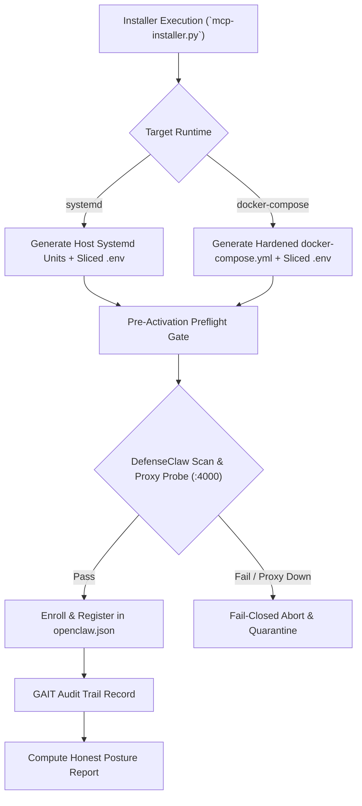

# QA / Test Architecture Assessment: Custom MCP Installer with DefenseClaw Production Mode

**Intake ID**: `2026-07-21-mcp-installer-defenseclaw`  
**Role**: QA / Test Architect (`intake-qa`)  
**Workspace**: `C:\Users\tyson\Documents\antigravity\amazing-babbage\netclaw`  
**Date**: 2026-07-21  

---

## 1. How We Verify Done (Verification Strategy)

Verification of Feature 057 is divided into automated test gates and manual operational checks to ensure both continuous integration readiness and field operator usability across dual execution targets (`--target systemd` and `--target docker-compose`).



### Automated Verification Pipeline
1. **Unit & Logic Testing**:
   - `pytest tests/n2n/test_mcp_installer.py` — Verifies selection parsing, dependency calculation, and registration schema updating.
   - `pytest tests/n2n/test_mcp_posture_dual_target.py` — Validates posture calculation (`production - enforced` vs `production - DEGRADED`) across systemd and containerized sandboxes.
   - `pytest tests/n2n/test_model_guard_failclosed.py` — Probes fail-closed blocking when DefenseClaw Model-Guard (`:4000`) is offline or returns component warnings.
   - `pytest tests/n2n/test_target_parity.py` — Validates security option parity between generated Docker Compose stacks and systemd unit templates.
2. **Static & Lint Security Checks**:
   - `ruff check scripts/mcp-installer.py tests/n2n/` — Enforces zero lint/style warnings.
   - `python scripts/scan-all-mcp-source.py` — Enforces pre-activation security scanning across selected MCP servers.

### Manual Verification Operational Checks
1. **CLI Dry-Run & Flag Validation**:
   - Interactive wizard check: Run `python scripts/mcp-installer.py --interactive` to verify prompt selection, toggle behavior, and preview summary.
   - Non-interactive flag check: Run `python scripts/mcp-installer.py --select gnmi-mcp,netbox-mcp --target docker-compose --dry-run` and inspect emitted files.
2. **Target Artifact Syntax & Hardening Check**:
   - Docker Compose: Run `docker compose -f docker-compose.yml config` to validate YAML schema and confirm `security_opt: [no-new-privileges:true]`, `read_only: true`, and volume bounds.
   - Systemd: Run `systemctl --user daemon-reload` and inspect generated unit files in `~/.config/systemd/user/`.
3. **Secret Isolation Audit**:
   - Confirm generated `.env.<mcp_name>` files contain only integration-specific keys and that the master `.env` is inaccessible to the worker process.
4. **GAIT Audit & Posture Verification**:
   - Execute `git log -n 5` in `~/.openclaw/n2n/gait/` to verify install/enrollment commit records.
   - Query posture engine to verify accurate status output matching live control states.

---

## 2. Existing Regression Coverage Analysis

An audit of the current test suite under `tests/n2n/` reveals strong foundational coverage for BGP posture calculation and systemd user services, but significant gaps regarding installer orchestration and Docker Compose deployment.

| Test File | Existing Coverage | Gap / Missing Coverage |
| :--- | :--- | :--- |
| `tests/n2n/test_posture.py` | Control aggregation (`sandbox`, `model-guard`, `audit`), state evaluation (`enforced`, `testing`, `degraded`), missing control handling. | Lacks dynamic target assessment (`docker-compose` vs `systemd`) and container-specific control degradation evaluation. |
| `tests/n2n/test_controls_failclosed.py` | Probes `openshell`, `defenseclaw`, and `gait`; enforces preflight delegation rejection on missing containment controls. | Does not verify fail-closed pre-activation behavior during initial MCP installation/enabling. |
| `tests/n2n/test_durable_services.py` | Systemd service lifecycle management via `in2n-services.py`, unit template rendering, `Restart=always` policies. | Lacks `docker-compose.yml` stack generation tests and parity assertion between Docker and systemd runtimes. |
| `tests/n2n/test_gait_emit.py` | Append-only GAIT audit logging and SQLite cross-referencing. | Missing installer event logging assertions (install, skip, quarantine, uninstall). |

---

## 3. Required New & Updated Tests

Four new test modules must be implemented under `tests/n2n/` to guard the new installer, dual-runtime target generation, fail-closed enforcement, and security parity.

```
tests/
└── n2n/
    ├── test_mcp_installer.py            # [NEW] Installer CLI selection, registration, & secret slicing
    ├── test_mcp_posture_dual_target.py  # [NEW] Posture engine calculation per target (docker vs systemd)
    ├── test_model_guard_failclosed.py   # [NEW] Model-Guard proxy (:4000) fail-closed & scanning gates
    └── test_target_parity.py            # [NEW] Docker Compose vs Systemd security constraint parity
```

### 1. `tests/n2n/test_mcp_installer.py` (Selective MCP Installer Test)
- **Objective**: Test `scripts/mcp-installer.py` selection logic, config manipulation, and secret isolation.
- **Key Test Cases**:
  - `test_select_subset_mcps()`: Select 2 of 27 servers; verify `openclaw.json` is updated with exactly those 2 servers registered.
  - `test_exclude_flag()`: Select `--all` with `--exclude obsolete-mcp`; verify exclusion.
  - `test_sliced_env_generation()`: Verify `.env.gnmi-mcp` is written with only gNMI variables and does not include unrelated secrets from master `.env`.
  - `test_invalid_mcp_name_fails()`: Attempt to install non-existent server name; verify non-zero exit code and error message.

### 2. `tests/n2n/test_mcp_posture_dual_target.py` (Dual-Target Posture Calculation Test)
- **Objective**: Verify posture engine accurate calculation under DEC-001 (systemd vs docker-compose targets).
- **Key Test Cases**:
  - `test_systemd_target_enforced()`: Host with systemd security enabled reports `production - enforced`.
  - `test_docker_compose_target_enforced()`: Docker Compose stack with full security options (`no-new-privileges`, read-only root, sliced env) reports `production - enforced`.
  - `test_docker_compose_unhardened_degraded()`: Docker Compose stack missing `no-new-privileges` or with unisolated master `.env` reports `production - DEGRADED (containment:unhardened_container)`.
  - `test_testing_mode_override()`: `N2N_RISK_MODE=testing` returns `testing` posture regardless of runtime target.

### 3. `tests/n2n/test_model_guard_failclosed.py` (Model-Guard & Pre-Activation Fail-Closed Test)
- **Objective**: Ensure no MCP server is enabled if Model-Guard proxy (`:4000`) is unreachable or source scanning fails.
- **Key Test Cases**:
  - `test_installer_aborts_when_proxy_down()`: Mock `:4000` down in `N2N_RISK_MODE=production`; verify installer aborts installation without registering server.
  - `test_installer_quarantines_on_scan_failure()`: Mock scanner detecting severity warning in MCP source; verify server is flagged as quarantined and installation blocked.
  - `test_strict_all_blocks_on_gait_error()`: Set `N2N_STRICT_ALL=1` with missing GAIT repo; verify installation fails closed.

### 4. `tests/n2n/test_target_parity.py` (Docker Compose vs Systemd Parity Test)
- **Objective**: Assert security equivalence between systemd and containerized execution targets.
- **Key Test Cases**:
  - `test_security_directive_parity()`: Assert systemd `NoNewPrivileges=yes` maps to Docker Compose `security_opt: [no-new-privileges:true]`.
  - `test_read_only_filesystem_parity()`: Assert systemd `ProtectSystem=strict` maps to Docker Compose `read_only: true` with explicit `tmpfs` mounts.
  - `test_secret_slice_parity()`: Assert both targets bind isolated `.env.<mcp_name>` files without exposing the master `.env`.

---

## 4. Test Data & Fixtures

New test fixtures will be established under `tests/fixtures/mcp_installer/` to support deterministic offline testing without requiring live Docker daemons or systemd user sessions.

```
tests/fixtures/mcp_installer/
├── mock_mcp_servers/
│   ├── clean_mcp/                 # Valid, compliant FastMCP server
│   └── vulnerable_mcp/            # MCP server with synthetic security issue
├── mock_master_env                # Sample master environment file with multi-server secrets
├── mock_openclaw_json             # Template openclaw.json for registration testing
└── mock_defenseclaw_proxy.py      # Async HTTP stub server simulating :4000 proxy responses
```

### Fixture Definitions
- **`mock_mcp_servers/`**: Lightweight Python packages simulating local MCP servers for installation, registration, and scanning validation.
- **`mock_defenseclaw_proxy.py`**: A `pytest` fixture using `aiohttp` or `http.server` to simulate DefenseClaw Model-Guard proxy responses on port `:4000` (supporting clean 200 OK, scan error 422, and offline connection refused states).
- **`gait_temp_repo`**: A `pytest` fixture providing a temporary git repository simulating `~/.openclaw/n2n/gait/` for audit trail verification.

---

## 5. Definition of Done (DoD) Checklist

To ensure high quality and prevent security regressions, the following criteria must be satisfied prior to merging Feature 057:

### Technical & Quality Gates
- [ ] All 4 new test modules (`test_mcp_installer.py`, `test_mcp_posture_dual_target.py`, `test_model_guard_failclosed.py`, `test_target_parity.py`) pass cleanly via `pytest`.
- [ ] Existing `tests/n2n/` regression suite passes with 0 failures.
- [ ] Code meets style standards with zero errors reported by `ruff check scripts/mcp-installer.py tests/n2n/`.

### Security & Posture Gates
- [ ] Pre-activation source code scan via `scripts/scan-all-mcp-source.py` executes automatically before enabling any selected server.
- [ ] Model-Guard proxy (`:4000`) connectivity and fail-closed preflight checks are verified.
- [ ] Per-integration secret slicing (`.env.<mcp_name>`) is enforced; master `.env` is never mounted or passed directly to worker processes.
- [ ] Posture calculation truthfully reports `production - enforced` or `production - DEGRADED` depending on active target security controls.

### Operational & Artifact Gates
- [ ] `scripts/mcp-installer.py` supports both interactive TUI wizard mode and non-interactive CLI flags (`--select`, `--all`, `--exclude`, `--target`).
- [ ] Dual-target generation correctly produces hardened `docker-compose.yml` files and host `systemd` user service units.
- [ ] Every install, skip, and quarantine event is written to the append-only GAIT audit log at `~/.openclaw/n2n/gait/`.
