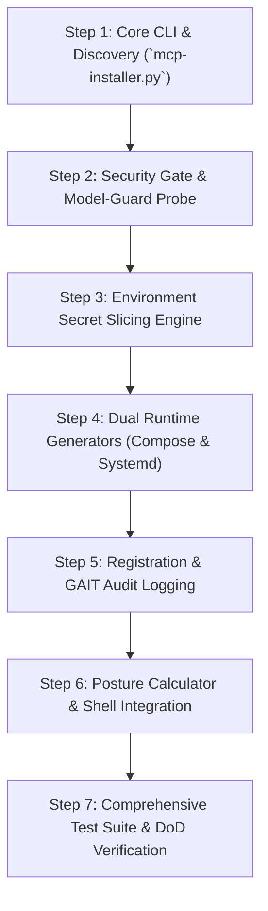

# Technical Plan — Custom Installer for MCP Servers with DefenseClaw Production Mode

**Intake ID**: `2026-07-21-mcp-installer-defenseclaw`  
**Target Feature**: Feature 057 — N2N Production Posture & Selective MCP Server Installer  
**Workspace**: `C:\Users\tyson\Documents\antigravity\amazing-babbage\netclaw`  
**Author**: Tech Lead (`intake-tech-lead`)  
**Date**: 2026-07-21  
**Status**: APPROVED / READY FOR BUILD  

---

## 1. Objective & Recommended Approach

### Objective
Provide a selective MCP server installer CLI and interactive wizard (`scripts/mcp-installer.py`) for NetClaw that enables operators to select, enable, or skip any subset of NetClaw's 27+ MCP servers in `mcp-servers/`. The installer must support dual runtime provisioning targets (Docker Compose container stacks via `--target docker-compose` and native host systemd user units via `--target systemd` per DEC-001) while strictly enforcing **DefenseClaw Production Mode** (`N2N_RISK_MODE=production`).

### Recommended Approach
1. **Unified CLI/TUI Utility (`scripts/mcp-installer.py`)**:
   - Provide interactive menu selection (TTY auto-detected) and CLI flags (`--select`, `--all`, `--exclude`, `--target`, `--mode`, `--list`, `--dry-run`, `--status`).
   - Discover all 27+ MCP server definitions, entry points, and environment dependencies in `mcp-servers/`.
2. **Fail-Closed Security Gate**:
   - Execute static source code scan via `scripts/scan-all-mcp-source.py` prior to activation. Any HIGH/CRITICAL finding aborts activation and flags server as quarantined.
   - Perform preflight probe on DefenseClaw Model-Guard proxy (`:4000`). If unreachable in production mode, abort setup fail-closed.
3. **Least-Privilege Secret Slicing Engine**:
   - Extract required environment keys per MCP server from host/master environment and write isolated `.env.<mcp_name>` files with `0600` permissions under `config/env/`.
   - Prevent any MCP process or container from accessing master `~/.openclaw/.env`.
4. **Dual Runtime Target Provisioning (DEC-001)**:
   - For `--target systemd`: Delegate to `scripts/in2n-services.py` to emit host systemd user unit files with kernel confinement (`NoNewPrivileges=yes`, `ProtectSystem=strict`, `PrivateTmp=yes`, `InaccessiblePaths=-%h/.openclaw/.env`).
   - For `--target docker-compose`: Emit a production-grade `docker-compose.mcp.yml` with hardened OCI container profiles (`security_opt: ["no-new-privileges:true"]`, `read_only: true`, `cap_drop: ["ALL"]`, `tmpfs: ["/tmp"]`, sliced env mounts, network bridge to `:4000`).
5. **Audit Trail & Honest Posture Engine**:
   - Write append-only enrollment logs and git commits to GAIT trail (`~/.openclaw/n2n/gait/`).
   - Calculate and publish dynamic posture status (`production - enforced` vs `production - DEGRADED (<reasons>)`).

---

## 2. Change Set

The implementation is structured across 4 main software layers in `netclaw`:

### A. Core Installer Utility & CLI Layer
- **`scripts/mcp-installer.py`** *(New File)*:
  - CLI parser & TUI interactive wizard.
  - Server discovery module scanning `mcp-servers/*/`.
  - Secret slicing engine creating `config/env/.env.<mcp_name>`.
  - Fail-closed security scan & proxy preflight orchestrator.
  - Target generator dispatch (`systemd` vs `docker-compose`).
  - GAIT audit logger & runtime posture evaluator.

### B. Service Registration & Orchestration Layer
- **`scripts/register-mcps-with-defenseclaw.py`** *(Modify File)*:
  - Add `--select` parameter for selective server registration.
  - Add `verify_model_guard_proxy(port=4000)` preflight connectivity probe.
  - Enforce fail-closed registration gate under `N2N_RISK_MODE=production`.
- **`scripts/in2n-services.py`** *(Modify File)*:
  - Add `_mcp_unit_text()` generator helper for individual MCP user systemd units.
  - Update `cmd_generate()` to accept selective list of MCP servers and map sliced `.env.<mcp_name>` paths.
- **`scripts/lib/mcp_compose.py`** *(New File)*:
  - Compose stack generator emitting hardened `docker-compose.mcp.yml` with container security opts (`no-new-privileges`, read-only root, cap drops, isolated bridge network).

### C. Installation Integration & Configuration Layer
- **`scripts/install.sh` & `scripts/setup.sh`** *(Modify Files)*:
  - Add optional selective MCP installer step invoking `scripts/mcp-installer.py`.
- **`config/openclaw.json` & `~/.openclaw/config/openclaw.json`** *(Managed Schema)*:
  - Dynamic updates to `mcpServers` object matching selected/enabled servers.

### D. Automated Test Suite Layer
- **`tests/n2n/test_mcp_installer.py`** *(New File)*: Unit & integration tests for installer CLI selection, secret slicing, and registration.
- **`tests/n2n/test_mcp_posture_dual_target.py`** *(New File)*: Posture calculation tests across systemd and docker-compose targets.
- **`tests/n2n/test_model_guard_failclosed.py`** *(New File)*: Tests verifying fail-closed pre-activation behavior when proxy is down or scan fails.
- **`tests/n2n/test_target_parity.py`** *(New File)*: Security directive parity tests between docker-compose and systemd.
- **`tests/fixtures/mcp_installer/`** *(New Test Fixtures)*: Mock MCP server packages, mock master env, and HTTP proxy stub fixture (`mock_defenseclaw_proxy.py`).

---

## 3. Sequenced Implementation Steps



### Step 1: Core CLI & Server Discovery
- Create `scripts/mcp-installer.py` with `argparse` CLI supporting `--list`, `--select`, `--all`, `--exclude`, `--target`, `--mode`, `--dry-run`, `--interactive`, `--status`.
- Implement `discover_mcp_servers()` scanning `mcp-servers/` directories for manifest files, entry points, and schema definitions.
- Implement TTY auto-detection: if non-interactive and no `--select`/`--all` provided, fail with descriptive usage.

### Step 2: Pre-Activation Security Gate & Model-Guard Preflight
- Integrate static code scan in `run_preactivation_scan(mcp_name)` by invoking `scripts/scan-all-mcp-source.py`. Block installation if HIGH/CRITICAL issues found when `N2N_RISK_MODE=production`.
- Add `verify_model_guard_proxy()` in `scripts/register-mcps-with-defenseclaw.py` checking TCP/HTTP health on port `:4000`. Fail closed if proxy is unreachable in production mode.

### Step 3: Least-Privilege Environment Secret Slicing Engine
- Implement `slice_secrets_for_mcp(mcp_name, required_keys)` in `scripts/mcp-installer.py`.
- Parse environment key requirements from MCP schemas/configs, extract values from host environment/master `.env`, and write `config/env/.env.<mcp_name>` with strict `0600` permissions.
- Validate master `.env` is unreadable by worker process contexts.

### Step 4: Dual Runtime Provisioning Generators (DEC-001)
- Create `scripts/lib/mcp_compose.py` implementing `generate_docker_compose(selected_mcps, output_path)` emitting production `docker-compose.mcp.yml` with:
  - `security_opt: ["no-new-privileges:true"]`
  - `read_only: true`
  - `cap_drop: ["ALL"]`
  - `tmpfs: ["/tmp"]`
  - Sliced env file bind: `env_file: ["config/env/.env.<mcp_name>"]`
  - Network bridge connected to `defenseclaw-proxy:4000`.
- Update `scripts/in2n-services.py` with `_mcp_unit_text()` emitting systemd user units with `NoNewPrivileges=yes`, `ProtectSystem=strict`, `PrivateTmp=yes`, and `InaccessiblePaths=-%h/.openclaw/.env`.

### Step 5: OpenClaw Registration & GAIT Audit Logging
- Extend `scripts/register-mcps-with-defenseclaw.py` to support `--select` list registration.
- Implement `commit_gait_audit_event(action, mcp_name, target)` writing append-only JSON audit events and git commits to `~/.openclaw/n2n/gait/`.

### Step 6: Posture Calculator & Shell Integration
- Implement `calculate_runtime_posture(target, selected_mcps)` returning `production - enforced`, `production - DEGRADED (<reasons>)`, or `testing`.
- Update `scripts/install.sh` and `scripts/setup.sh` to offer interactive selective MCP installation step.

### Step 7: Test Suite Implementation & Verification
- Create test files (`tests/n2n/test_mcp_installer.py`, `test_mcp_posture_dual_target.py`, `test_model_guard_failclosed.py`, `test_target_parity.py`) and mock fixtures under `tests/fixtures/mcp_installer/`.
- Run pytest suite and ruff linter checks.

---

## 4. Single-Source-of-Truth Guardrail

To maintain configuration consistency across runtime targets and tools:
- **`config/openclaw.json` (and `~/.openclaw/config/openclaw.json`)** is the **SOLE AUTHORITATIVE SOURCE OF TRUTH** for registered MCP servers and active runtime posture configurations.
- Both runtime target generators (`docker-compose.mcp.yml` generator and `in2n-services.py` systemd unit generator) MUST read directly from `openclaw.json` registration entries and MUST NOT maintain independent server lists or state files.
- The GAIT audit log at `~/.openclaw/n2n/gait/` records append-only history of mutations to `openclaw.json`.
- In cases of mismatch between active units/containers and `openclaw.json`, `openclaw.json` governs, and the posture engine flags state as `DEGRADED (config_state_drift)`.

---

## 5. Testing & Verification

### Automated Test Commands
```bash
# 1. Run all installer and dual-target N2N tests
pytest tests/n2n/test_mcp_installer.py tests/n2n/test_mcp_posture_dual_target.py tests/n2n/test_model_guard_failclosed.py tests/n2n/test_target_parity.py -v

# 2. Run full existing N2N regression suite
pytest tests/n2n/ -v

# 3. Code formatting & linting verification
ruff check scripts/mcp-installer.py scripts/lib/mcp_compose.py tests/n2n/
```

### Manual Verification Checklist
- [ ] **Interactive TUI Check**: Run `python scripts/mcp-installer.py --interactive` and verify menu rendering, checkbox selection, and preview summary.
- [ ] **CLI Selective Installation (Docker Compose)**: Run `python scripts/mcp-installer.py --select gnmi-mcp,batfish-mcp --target docker-compose --dry-run` and verify emitted `docker-compose.mcp.yml` contains `security_opt: ["no-new-privileges:true"]`.
- [ ] **CLI Selective Installation (Systemd)**: Run `N2N_RISK_MODE=production python scripts/mcp-installer.py --select gnmi-mcp --target systemd` and verify generated unit contains `NoNewPrivileges=yes` and `ProtectSystem=strict`.
- [ ] **Fail-Closed Proxy Check**: Stop proxy on `:4000`, run installer under `N2N_RISK_MODE=production`, and assert setup halts fail-closed with clear error.
- [ ] **Secret Slicing Check**: Inspect generated `config/env/.env.gnmi-mcp`; confirm file mode is `0600` and contains only gNMI variables.
- [ ] **GAIT Audit Check**: Check `git log -n 5` in `~/.openclaw/n2n/gait/` to confirm enrollment commit log.

---

## 6. Risks & Rollback

### Technical & Operational Risks
1. **WSL2 Systemd Kernel Confinement Failure**:
   - *Risk*: Advanced systemd sandboxing directives fail under WSL2 init (error 218/CAPABILITIES).
   - *Mitigation*: Installer detects WSL2 environment, applies portable filesystem sandboxing, and reports posture as `production - DEGRADED (WSL2_kernel_limitation)`.
2. **Master Secret Leakage in Multi-Tenant Containers**:
   - *Risk*: Container bind-mounting entire directory or master `.env`.
   - *Mitigation*: Enforce dedicated `env_file: ["config/env/.env.<mcp_name>"]` mounting; block root directory mounts.
3. **Broken Dependency / Proxy Socket Deadlock**:
   - *Risk*: Installer hanging when probing offline proxy socket.
   - *Mitigation*: Implement 3-second timeout on socket probe; fail fast with operational message.

### Rollback Plan
If installation or registration fails mid-operation:
1. **Restore Config**: Revert `config/openclaw.json` to previous version using GAIT snapshot (`git checkout HEAD -- config/openclaw.json`).
2. **Cleanup Secret Slices**: Remove generated sliced secret files (`rm -f config/env/.env.*`).
3. **Stop & Remove Services**:
   - Systemd: Execute `systemctl --user stop openclaw-mcp-*.service` and remove unit files from `~/.config/systemd/user/`.
   - Docker Compose: Execute `docker compose -f docker-compose.mcp.yml down --volumes`.
4. **Audit Rollback**: Record `quarantine_rollback` event in GAIT log trail.

---

## 7. Definition of Done Checklist

- [ ] `scripts/mcp-installer.py` CLI & TUI wizard implemented supporting all required flags (`--select`, `--all`, `--exclude`, `--target`, `--mode`, `--list`, `--dry-run`, `--status`).
- [ ] Fail-closed pre-activation scanner gate (`scripts/scan-all-mcp-source.py`) and Model-Guard proxy socket probe (`:4000`) enforced in `N2N_RISK_MODE=production`.
- [ ] Environment secret slicing engine produces isolated `.env.<mcp_name>` files with `0600` permissions.
- [ ] Dual runtime target provisioning supported per DEC-001 (hardened `docker-compose.mcp.yml` and host `systemd` user units via `in2n-services.py`).
- [ ] GAIT append-only audit trail records all install/enrollment events to `~/.openclaw/n2n/gait/`.
- [ ] Honest runtime posture calculation engine implemented (`production - enforced` vs `production - DEGRADED`).
- [ ] All 4 new test suites (`test_mcp_installer.py`, `test_mcp_posture_dual_target.py`, `test_model_guard_failclosed.py`, `test_target_parity.py`) pass cleanly.
- [ ] Full existing `tests/n2n/` regression suite passes with 0 failures.
- [ ] Zero linting errors from `ruff check`.
- [ ] `technical-plan.md` saved and ready for implementation.
